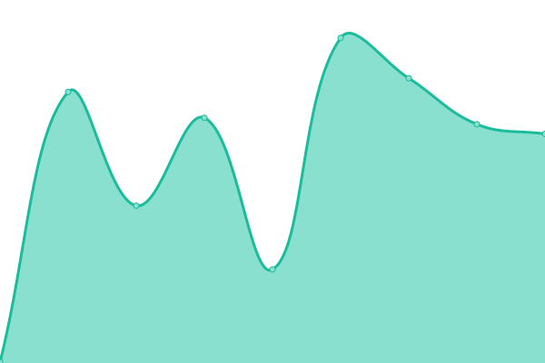
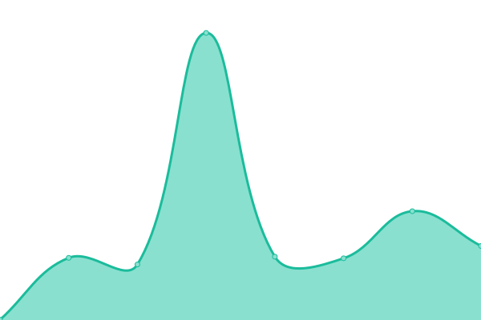
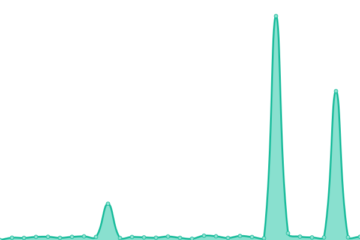
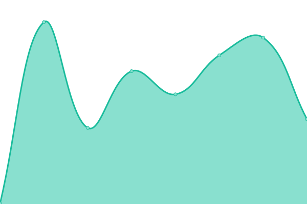
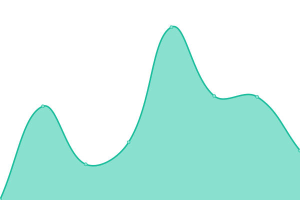
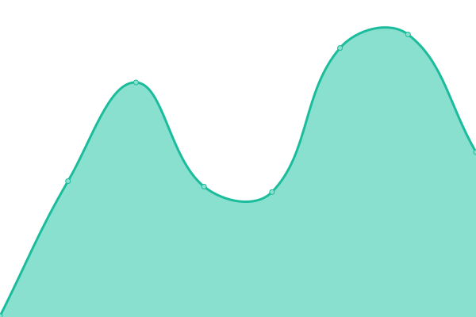

# [📈 Live Status](https://xnaas.github.io/rimgo-instances): <!--live status--> **🟧 Partial outage**

This repository contains the open-source uptime monitor and status page for [xnaas](https://xnaas.info/), powered by [Upptime](https://github.com/upptime/upptime).

With [Upptime](https://upptime.js.org), you can get your own unlimited and free uptime monitor and status page, powered entirely by a GitHub repository. We use [Issues](https://github.com/xnaas/rimgo-instances/issues) as incident reports, [Actions](https://github.com/xnaas/rimgo-instances/actions) as uptime monitors, and [Pages](https://xnaas.github.io/rimgo-instances) for the status page.

<!--start: status pages-->
<!-- This summary is generated by Upptime (https://github.com/upptime/upptime) -->
<!-- Do not edit this manually, your changes will be overwritten -->
<!-- prettier-ignore -->
| URL | Status | History | Response Time | Uptime |
| --- | ------ | ------- | ------------- | ------ |
|  [i.bcow.xyz](https://i.bcow.xyz) | 🟩 Up | [i-bcow-xyz.yml](https://github.com/xnaas/rimgo-instances/commits/HEAD/history/i-bcow-xyz.yml) | 

 258ms
     
 | 

<a href="https://xnaas.github.io/rimgo-instances/history/i-bcow-xyz">100.00%</a>
    

|  [rimgo.pussthecat.org](https://rimgo.pussthecat.org) | 🟩 Up | [rimgo-pussthecat-org.yml](https://github.com/xnaas/rimgo-instances/commits/HEAD/history/rimgo-pussthecat-org.yml) | 

 547ms
     
 | 

<a href="https://xnaas.github.io/rimgo-instances/history/rimgo-pussthecat-org">100.00%</a>
    

|  [img.riverside.rocks](https://img.riverside.rocks) | 🟥 Down | [img-riverside-rocks.yml](https://github.com/xnaas/rimgo-instances/commits/HEAD/history/img-riverside-rocks.yml) | 

 293ms
     
 | 

<a href="https://xnaas.github.io/rimgo-instances/history/img-riverside-rocks">8.95%</a>
    

|  [rimgo.totaldarkness.net](https://rimgo.totaldarkness.net) | 🟩 Up | [rimgo-totaldarkness-net.yml](https://github.com/xnaas/rimgo-instances/commits/HEAD/history/rimgo-totaldarkness-net.yml) | 

 869ms
     
 | 

<a href="https://xnaas.github.io/rimgo-instances/history/rimgo-totaldarkness-net">98.58%</a>
    

|  [rimgo.bus-hit.me](https://rimgo.bus-hit.me) | 🟩 Up | [rimgo-bus-hit-me.yml](https://github.com/xnaas/rimgo-instances/commits/HEAD/history/rimgo-bus-hit-me.yml) | 

 250ms
     
 | 

<a href="https://xnaas.github.io/rimgo-instances/history/rimgo-bus-hit-me">100.00%</a>
    

|  [rimgo.esmailelbob.xyz](https://rimgo.esmailelbob.xyz) | 🟩 Up | [rimgo-esmailelbob-xyz.yml](https://github.com/xnaas/rimgo-instances/commits/HEAD/history/rimgo-esmailelbob-xyz.yml) | 

 426ms
     
 | 

<a href="https://xnaas.github.io/rimgo-instances/history/rimgo-esmailelbob-xyz">100.00%</a>
    

|  [rimgo.lunar.icu](https://rimgo.lunar.icu) | 🟥 Down | [rimgo-lunar-icu.yml](https://github.com/xnaas/rimgo-instances/commits/HEAD/history/rimgo-lunar-icu.yml) | 

 480ms
     
 | 

<a href="https://xnaas.github.io/rimgo-instances/history/rimgo-lunar-icu">58.36%</a>
    

|  [i.actionsack.com](https://i.actionsack.com) | 🟥 Down | [i-actionsack-com.yml](https://github.com/xnaas/rimgo-instances/commits/HEAD/history/i-actionsack-com.yml) | 

 187ms
     
 | 

<a href="https://xnaas.github.io/rimgo-instances/history/i-actionsack-com">98.46%</a>
    

<!--end: status pages-->

[**Visit our status website →**](https://xnaas.github.io/rimgo-instances)

## 📄 License

- Powered by: [Upptime](https://github.com/upptime/upptime)
- Code: [MIT](./LICENSE) © [xnaas](https://xnaas.info/)
- Data in the `./history` directory: [Open Database License](https://opendatacommons.org/licenses/odbl/1-0/)
